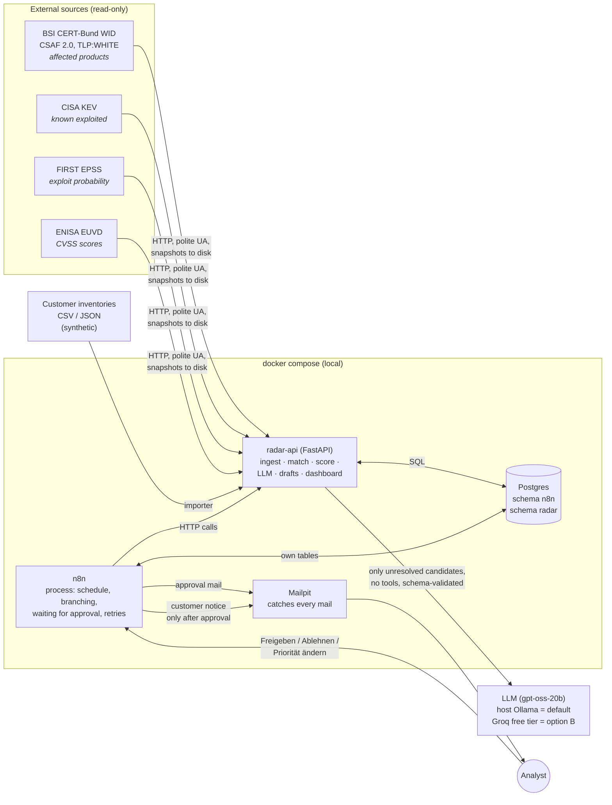
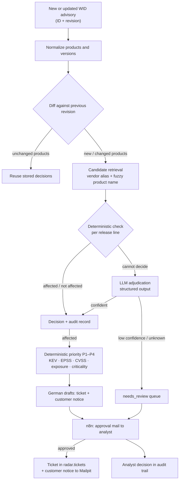

# Architecture

**Design principle:** the LLM translates language into structure; deterministic code
decides; a human approves.

## Components

## Data flow for one advisory

## Responsibilities

| Component | Owns | Does not do |
|---|---|---|
| n8n | Scheduling, branching, waiting for the human, retries, error workflow, notifications | Business logic, LLM calls, SQL on `radar` tables |
| radar-api | Ingestion, normalization, matching, scoring, LLM calls, drafts, dashboard, eval | Sending mail to customers (n8n does it, after approval) |
| LLM | Language → structure: fuzzy product matching, German summaries, draft texts | Priority, sending, any action on a system |
| Analyst | The final decision for every ticket and every customer notice | – |

## Where the trust boundaries are

- **Advisory and inventory text is untrusted input.** It reaches the LLM only inside
  delimiters, marked as data. The LLM has no tools, and its output must pass a
  Pydantic schema.
- **Customer data stays local by default.** The default LLM provider is the local
  Ollama. Groq is only used for development and eval runs on synthetic data (D-015).
- **Priority is computed in code** from `config/scoring.yaml`. An LLM answer cannot
  change it.
- **Nothing reaches a customer without a logged approval.** The only path to a customer
  mail goes through the n8n approval step.

## Ports (all bound to 127.0.0.1)

| Service | URL |
|---|---|
| radar-api / dashboard | http://localhost:8000 |
| n8n | http://localhost:5678 |
| Mailpit | http://localhost:8025 |
| Postgres | localhost:5432 |
| Ollama (profile `local-llm`) | http://localhost:11435 |
